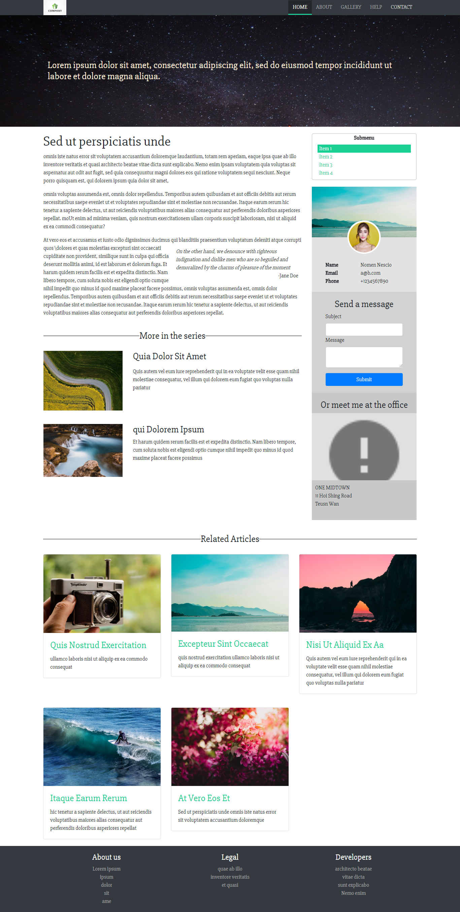

#Basic React Based Webpage

###Features

- `react-router-dom` used to create routes inside and outside of page
- Bootstraped using `create-react-app` 
- Navigation Bar added
- Styled using Bootstrap v4
- Sub-menu Added
- `google-map-react` used to attach google maps.
- Responsive layout

--------
###Commands

-  Use `npm i` to install all the dependencies. 
- `npm start` to run the project in development mode
- `npm run build` to build the project in production mode

